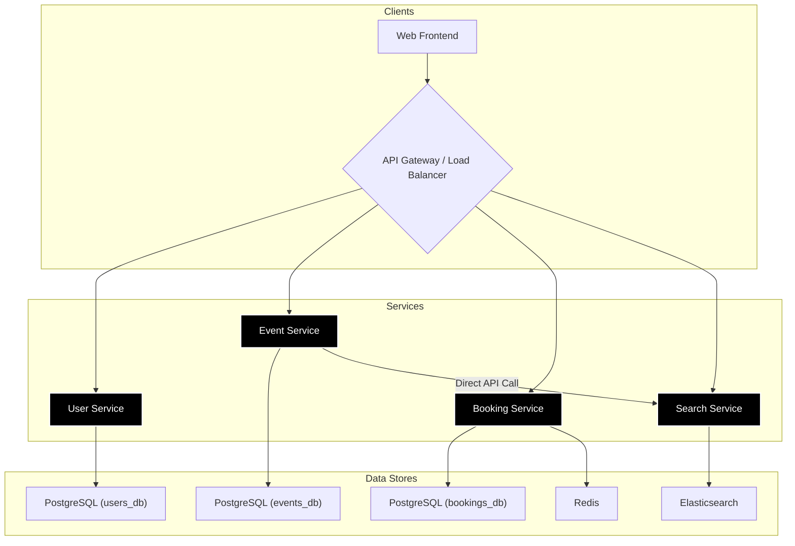
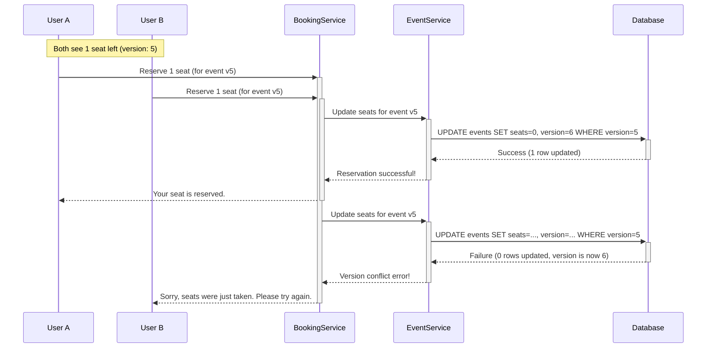

# Evently - High-Performance Event Booking Platform

Evently is a scalable, high-performance event booking platform designed to handle a large volume of concurrent ticket sales with zero overselling. It provides a robust backend system built on a microservices architecture, ensuring reliability and data consistency under pressure.

## ✨ Key Features

- **Zero Overselling**: Guarantees data integrity during high-traffic sales using optimistic locking and atomic operations.
- **High Concurrency**: Architected to manage thousands of simultaneous booking requests gracefully.
- **Real-Time Search**: Lightning-fast event discovery powered by Elasticsearch.
- **Smart Waitlisting**: An automated queueing system for sold-out events to notify users when tickets become available.
- **Two-Phase Booking**: A reserve-then-confirm workflow ensures a smooth and fair booking process.

## 🚀 Getting Started

This project is managed with `make` and `docker-compose`. Ensure you have Docker, Go, and `make` installed.

1.  **Initial Setup (One-Time)**:
    This command starts the required infrastructure (PostgreSQL, Redis, Elasticsearch), runs database migrations, starts all services in the background, and seeds the database with initial data.

    ```bash
    make dev-setup-full
    ```

2.  **Stop Everything**:
    To stop all running services and shut down the Docker containers:

    ```bash
    make kill-services
    make docker-down
    ```

For a full list of commands (e.g., running individual services, managing migrations), see the `DEV_COMMANDS_REFERENCE.md` or run `make help`.

## 🛠️ Tech Stack

- **Backend**: Go
- **Frontend**: React (Vite)
- **Primary Database**: PostgreSQL (with separate databases per service)
- **Caching & In-Memory Storage**: Redis
- **Search & Indexing**: Elasticsearch
- **Containerization**: Docker & Docker Compose
- **Database Migrations**: `goose`
- **ORM / Query Generation**: `sqlc`

## 🏛️ System Design

The platform uses a microservices architecture to decouple concerns and enhance scalability. An API Gateway would typically sit in front of the services to handle routing, authentication, and rate limiting.



## 🔑 Key API Endpoints

This is not an exhaustive list but highlights the core functionality of the platform.

#### User Service

-   `POST /api/v1/auth/register`: Creates a new user account.
-   `POST /api/v1/auth/login`: Authenticates a user and returns JWT tokens.
-   `GET /api/v1/users/profile`: Retrieves the profile for the authenticated user.
-   `POST /internal/auth/verify`: **(Internal)** Verifies a JWT token's validity for other services.

#### Event Service

-   `GET /api/v1/events`: Lists all publicly available events with filtering.
-   `GET /api/v1/events/{id}`: Retrieves detailed information for a single event.
-   `POST /api/v1/admin/events`: **(Admin)** Creates a new event.
-   `POST /internal/events/{id}/update-availability`: **(Internal)** Atomically updates the seat count for an event, used by the Booking Service.

#### Search Service

-   `GET /api/v1/search`: Performs a full-text search for events with filtering and sorting.
-   `GET /api/v1/search/suggestions`: Provides autocomplete suggestions for search queries.
-   `POST /internal/search/events`: **(Internal)** Indexes a new or updated event document.

#### Booking Service

-   `POST /api/v1/bookings/reserve`: **(Phase 1)** Reserves seats for an event with a 5-minute hold.
-   `POST /api/v1/bookings/confirm`: **(Phase 2)** Confirms a reservation and processes payment.
-   `POST /api/v1/waitlist/join`: Adds a user to the waitlist for a sold-out event.
-   `DELETE /api/v1/bookings/{id}`: Cancels a confirmed booking.

## ⚙️ Architectural Flow & Service Roles

Evently's architecture is designed for separation of concerns, ensuring that each microservice has a distinct and clear responsibility.

-   **User Service**: This is the gateway for user authentication. It handles registration and login, issuing JWT access and refresh tokens to provide a seamless and secure user session.

-   **Event Service**: This service is the **single source of truth** for all event and venue data. It manages creation, updates, and availability. To optimize for performance, write operations are handled here, while read-intensive search queries are offloaded to a dedicated search engine.

-   **Search Service**: For a fast user experience, all event data is indexed in **Elasticsearch**. This allows for complex filtering, geo-spatial queries, and full-text search without putting a heavy load on the primary database. When an event is created or updated in the Event Service, it makes a direct, synchronous API call to the Search Service to ensure the search index is immediately updated.

-   **Booking Service**: This is the core transactional engine of the platform. It orchestrates the entire booking process, from reserving tickets and processing payments to managing cancellations and user booking history.

## 🧠 Architectural Challenges & Solutions

#### Concurrency: The Race to Zero Seats

This is the most critical challenge in a ticketing system. When thousands of users attempt to book the last few available seats simultaneously, the system must prevent overselling without deadlocking. Evently solves this with a multi-layered approach:

1.  **Optimistic Locking**: The `events` table has a `version` column. When a user tries to book a ticket, the service reads the event's current version number. The request to update the seat count will only succeed if the version in the database is the same as the one the service read. If another user's request was processed first, the version number will have changed, causing the second request to fail safely. The user is then prompted to try again.

2.  **Atomic Operations**: The SQL query to update the seat count is an atomic `UPDATE ... SET available_seats = available_seats - ? WHERE version = ?` operation, ensuring that checking the version and decrementing the seat count happen as a single, indivisible step.

Here is a diagram illustrating the flow:



#### The Two-Phase Booking Flow

To prevent users from holding tickets indefinitely without paying, Evently uses a two-phase system powered by Redis.

1.  **Phase 1: Reservation**: When a user initiates a booking, the Booking Service makes an internal call to the Event Service to secure the seats using the optimistic locking mechanism described above. Upon success, it creates a temporary reservation document in a **Redis cluster** with a 5-minute Time-To-Live (TTL).
2.  **Phase 2: Confirmation**: The user has 5 minutes to complete the payment. If the payment is successful within the time limit, the reservation is converted into a permanent booking in the PostgreSQL database, the temporary record in Redis is deleted, and the user's ticket history is updated. If the user fails to pay, the Redis key expires automatically, and a background job returns the seats to the available pool.

#### Waitlist Management

When an event sells out, users can join a waitlist. This waitlist is managed efficiently as a sorted set in **Redis**, with each user's entry timestamp acting as their score for prioritization. If a booking is cancelled, a background worker is triggered. Instead of returning the seats to the general pool, it retrieves the user at the top of the waitlist, removes them from the queue, and offers them an exclusive, short-term window (e.g., 10 minutes) to purchase the newly available tickets, ensuring a fair process for dedicated fans.

## 📦 Infrastructure Containers

-   **PostgreSQL**: The primary relational database used for persistent storage of users, events, and bookings. Each service connects to its own isolated database (`users_db`, `events_db`, `bookings_db`) to maintain service independence.
-   **Redis**: An in-memory data store used for high-speed operations. Its primary roles are caching frequently accessed data (like event availability) and temporarily storing booking reservations during the 5-minute payment window.
-   **Elasticsearch**: A powerful search engine that indexes event data. It enables fast, complex queries (full-text, geospatial, faceted search) that would be inefficient to perform on a relational database.

## 📂 Project Structure

-   `cmd/`: Contains the entry point for each microservice. Each subdirectory has a `main.go` file responsible for initializing and starting the service.
-   `docs/`: All project documentation, including API specifications, architectural diagrams, and development guides.
-   `frontend/`: The client-side React application that consumes the backend APIs.
-   `internal/`: Houses all the shared Go packages used across the different services to promote code reuse and maintain consistency.
    -   `auth/`: Handles JWT generation, validation, and middleware for both user and admin authentication.
    -   `config/`: Manages loading environment variables and configuration for each service.
    -   `database/`: Provides the database connection client for PostgreSQL.
    -   `middleware/`: Contains shared HTTP middleware, primarily for handling CORS.
    -   `repository/`: Holds the type-safe Go code that is automatically generated by `sqlc`.
    -   `utils/`: A collection of shared helper functions used across various services.
-   `migrations/`: Contains all SQL migration files for creating and modifying the database schemas, managed by `goose`.
-   `scripts/`: A collection of helper scripts for testing and development automation.
-   `services/`: This is where the core business logic for each microservice resides.
    -   `handler.go`: Defines the HTTP handlers for each API route, containing the main logic for requests.
    -   `server.go`: Defines the API routes for the service and maps them to their corresponding handlers.
-   `sqlc/`: Stores the raw SQL queries which `sqlc` uses to generate the Go code for database interactions, ensuring type safety.
-   `docker-compose.yml`: Defines the infrastructure services (PostgreSQL, Redis, Elasticsearch) needed for local development.
-   `Makefile`: Provides a simple and convenient set of commands to automate common development tasks like building, running, and testing the services.

